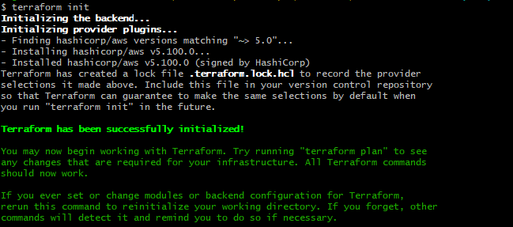
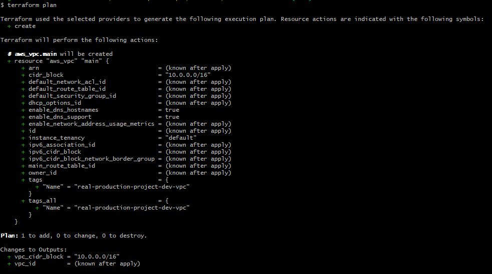
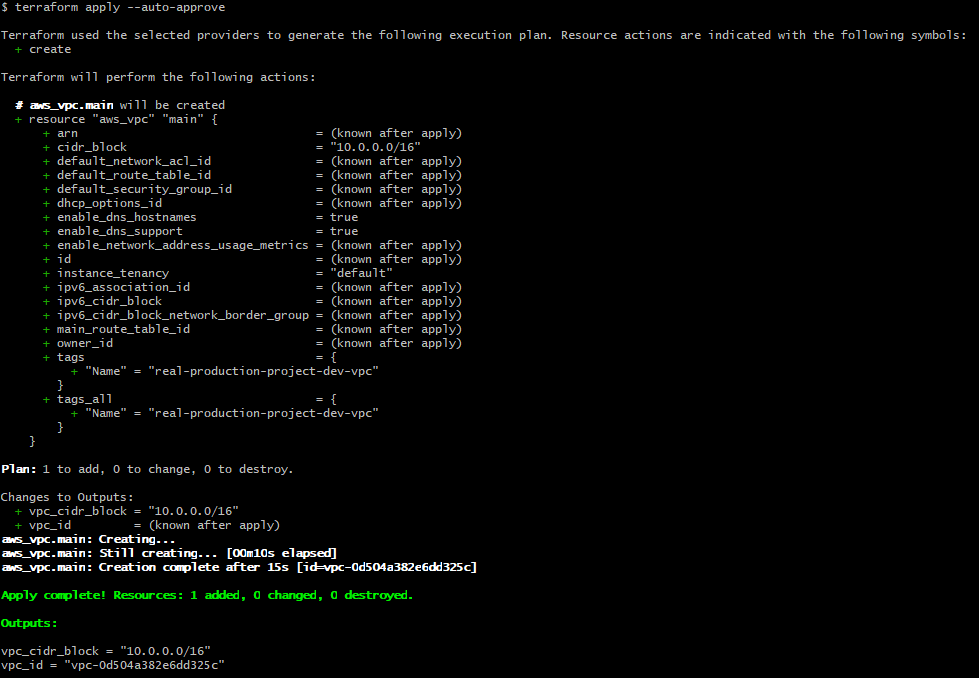

## Terraform commands

The below terraform command creates the infrastructure defined in the Terraform configuration.

### Commands

```bash
terraform init
```
### Output



```bash
terraform plan
```
### Output



```bash
terraform apply --auto-approve
```
### Output



# Day 12 — AWS Secrets Manager

## Objective

Store database credentials securely using AWS Secrets Manager
instead of hardcoding credentials in the application or EC2.

## Architecture

Private EC2
    |
    v
IAM Instance Profile
    |
    v
IAM Role
    |
    | secretsmanager:GetSecretValue
    v
AWS Secrets Manager
    |
    | DB credentials
    v
RDS PostgreSQL

## Resources Created

- AWS Secrets Manager Secret
- AWS Secrets Manager Secret Version
- IAM Policy
- IAM Role Policy Attachment

## Secret Contents

The secret contains:

- username
- password
- database name

The secret value must never be committed to GitHub.

## IAM Permission

The EC2 role was given only:

- secretsmanager:GetSecretValue

The permission is restricted to the specific database secret.

## Testing and Retrive the passwords from the Ec2 instance

From the private EC2:

```bash
aws sts get-caller-identity
aws secretsmanager get-secret-value --secret-id < Name of the secretmanager > --query SecretString --output text

